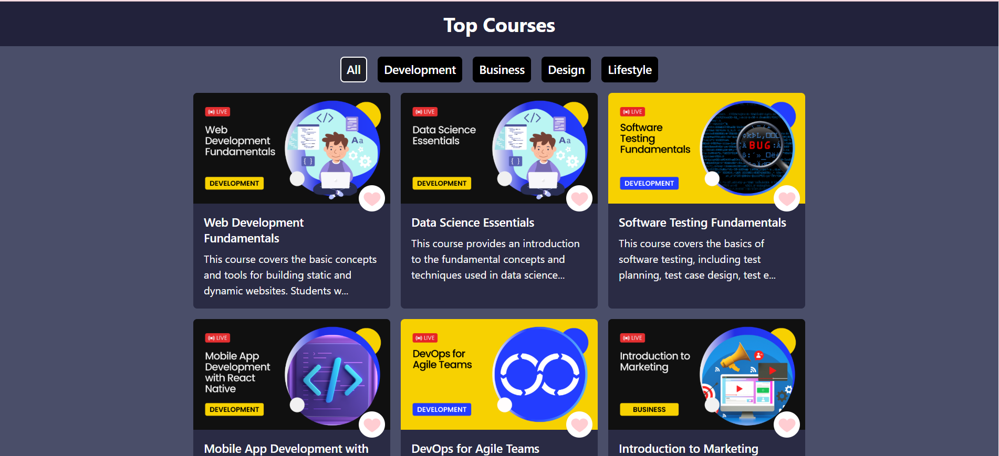
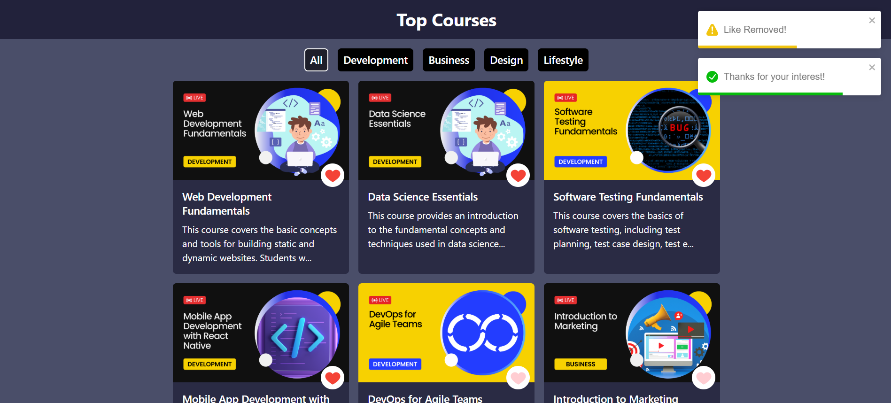

# 🎓 Top Courses

A responsive and modern web application that helps users discover top online courses across various platforms. Built using **ReactJS**, **Tailwind CSS**, and **Axios**.

---

## 📸 Demo

 

 


## 🚀 Features

- 🔍 Search and filter top-rated courses
- 🖼️ Card and List views
- 🌗 Light & Dark mode support
- 📊 Course details with rating and platform info
- 📱 Fully responsive design

---

## 🛠️ Tech Stack

- **Frontend**: ReactJS, Tailwind CSS
- **State & HTTP**: Axios, useState, useEffect
- **Icons**: Lucide React Icons

---

## 📂 Folder Structure

```bash
Top_Courses/
├── public/
├── src/
│   ├── assets/
│   ├── components/
│   ├── pages/
│   ├── App.jsx
│   └── main.jsx
├── tailwind.config.js
├── package.json
└── README.md
